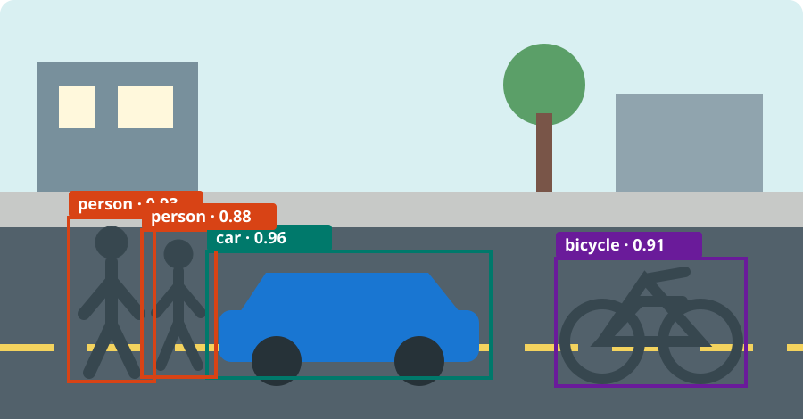

# Introduction to Object Detection: Bounding Boxes, Models, and Evaluation

Object detection answers two questions about an image: **what objects are present, and where is each individual object?** A detector might recognize “car” and locate three separate cars, returning one result per instance. Most detectors represent location with a rectangular bounding box.

## Related computer-vision tasks

Several vision tasks use the same image but produce different kinds of answers:

| Task | Typical question | Output |
| --- | --- | --- |
| Image classification | What is the main subject? | One or more labels for the entire image |
| Object detection | What objects are present, and where is each one? | A label and box for every detected instance |
| Semantic segmentation | What category does each pixel belong to? | A class label per pixel; instances of the same class are merged |
| Instance segmentation | Which pixels belong to each separate object? | A distinct pixel mask for every object instance |

For example, semantic segmentation can mark every road pixel and every person pixel. Instance segmentation goes further by keeping two neighboring people separate. Detection also separates those people, but describes each one with a box rather than a detailed mask.

## Illustrative street scene

The following diagram shows plausible detector output. It is an illustration, not a photograph or a benchmark result. Each colored rectangle identifies one object instance; repeated labels are allowed because there are two different people.

For each box, a detector typically returns:

- a **class label**, such as `person` or `car`;
- **bounding-box coordinates** describing the rectangle;
- a **confidence score**, such as `0.93`, estimating how strongly the model supports that prediction; and
- optionally, a numeric **class ID** used by the dataset or software, such as `2` for a particular category mapping.

Confidence is not a guarantee that a prediction is correct, and scores from different models may not be calibrated in the same way.

## Bounding-box formats

A box is usually stored as four numbers. Two common formats are:

- **`xyxy`**: `(x_min, y_min, x_max, y_max)`, the top-left and bottom-right corners.
- **`xywh`**: `(x, y, width, height)`, usually the top-left corner followed by the box size.

Coordinates may be pixel values or values normalized relative to image width and height. Conventions differ: in some systems, `xywh` uses the box center rather than its top-left corner. Always check a dataset or library’s documentation before converting coordinates. Measures such as Intersection over Union (IoU) compare boxes, while non-maximum suppression (NMS) removes many overlapping predictions. Their detailed mathematics belongs on a later page.

## The broad detection pipeline

A modern detector commonly follows this high-level path:

1. **Image input:** pixels are resized and normalized into the form expected by the model.
2. **Feature extraction:** a neural network transforms pixels into feature maps that capture visual patterns and context.
3. **Candidate predictions:** the detection head proposes classes, boxes, and confidence values. The exact mechanism depends on the detector family.
4. **Confidence filtering:** predictions below a chosen threshold are discarded.
5. **Post-processing:** remaining predictions are converted to image coordinates and, when required, overlapping duplicates are reduced—for example with NMS.

Preprocessing and post-processing matter: changing image size, class mappings, or thresholds can change detections even when the trained weights stay fixed.

## Major detector families

**Two-stage detectors**, represented by Faster R-CNN, first generate promising regions and then classify and refine them. Separating proposal generation from region-level prediction provides a clear structure, though it also adds stages to the computation.

**One-stage detectors**, including the YOLO family, predict object locations and classes directly from image features in one detection network. They are often chosen when a compact inference pipeline is important, but performance depends on the particular model, data, hardware, and operating point; the family name alone does not determine speed or accuracy.

**Set-prediction detectors**, represented by DETR, treat the answer as a set of objects. Learned queries and matching during training encourage one prediction per object, reducing reliance on hand-designed components such as anchors and, in the original formulation, NMS. These families are design approaches rather than a permanent ranking: each has many variations and trade-offs.

## Evaluating detections

Detection quality cannot be summarized responsibly as one ordinary classification accuracy. A prediction must have the right category *and* be located well enough.

**IoU** measures the overlap between a predicted box and a ground-truth box: the intersection area divided by the union area. A higher IoU means closer spatial agreement. An evaluation protocol chooses an IoU threshold to decide whether a prediction counts as a match.

**Precision** asks what fraction of reported detections are correct matches. **Recall** asks what fraction of annotated objects were found. Raising a confidence threshold often improves precision while reducing recall, so both should be examined across thresholds. **Average Precision (AP)** summarizes a precision–recall curve for a class under a defined evaluation protocol. Reports may average AP over categories and multiple IoU thresholds. Always state the dataset, IoU rules, and averaging procedure: a box that names the right object but covers it poorly may fail at a stricter localization threshold.

## Applications and limitations

Object detection supports traffic analysis, manufacturing inspection, wildlife monitoring, retail inventory, assistive technology, robotics, and medical-image workflows. Deployment requires validation. **Small objects** contain few useful pixels; **occlusion** hides features; and **domain shift** occurs when real images differ from training data in lighting, cameras, styles, or object populations. A model may produce **false positives**—objects that are not present—or **missed objects**. Dataset gaps and labeling choices can create uneven performance. In safety-sensitive uses, detection should be one component of a monitored system rather than unquestioned evidence.

## Where to go next

Later pages will develop datasets, model training, IoU and NMS, evaluation practice, and hands-on examples. For now, the key idea is that detection joins recognition with localization and must be judged on both.

## References

- [COCO dataset and detection tasks](https://cocodataset.org/)
- [Faster R-CNN paper](https://arxiv.org/abs/1506.01497)
- [Original YOLO paper](https://arxiv.org/abs/1506.02640)
- [DETR paper](https://arxiv.org/abs/2005.12872)
- [Torchvision model and object-detection documentation](https://docs.pytorch.org/vision/stable/models.html#object-detection-instance-segmentation-and-person-keypoint-detection)
